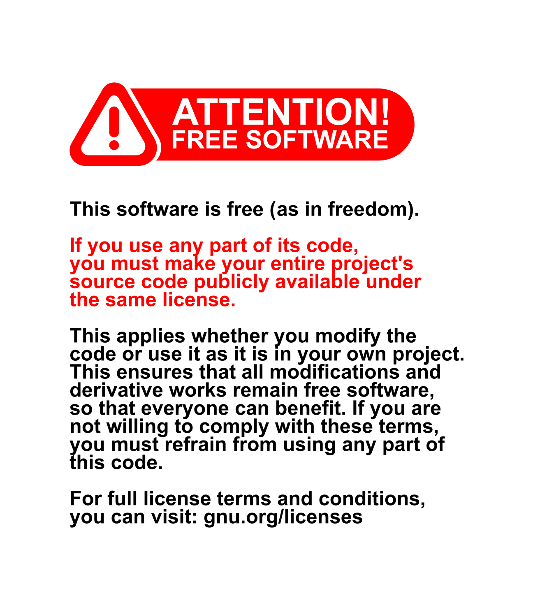

  

## Text

This software is free (as in freedom). If you use any part of this code, you must make your entire project's source code publicly available under the same license. This applies whether you modify the code or use it as it is in your own project. This ensures that all modifications and derivative works remain free software, so that everyone can benefit. If you are not willing to comply with these terms, you must refrain from using any part of this code.

For full license terms and conditions, you can visit: gnu.org/licenses

## Wikimedia Commons

- [Attention! Free Software](https://commons.wikimedia.org/wiki/File:Attention_Free_Software.svg)

## License

This work is licensed under a
[Creative Commons Attribution-ShareAlike 4.0 International License][cc-by-sa].

[![CC BY-SA 4.0][cc-by-sa-image]][cc-by-sa]

[cc-by-sa]: http://creativecommons.org/licenses/by-sa/4.0/
[cc-by-sa-image]: https://licensebuttons.net/l/by-sa/4.0/88x31.png
